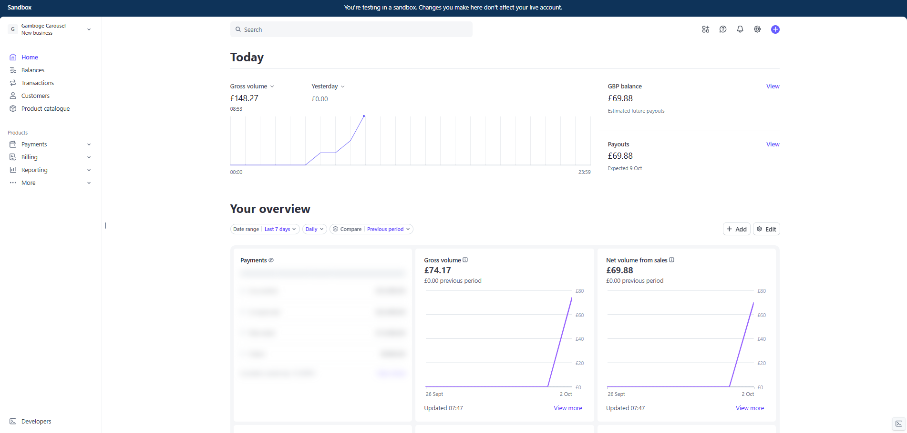

# Sofia Health - Appointment Booking System

A Django appointment booking system with Stripe payment integration.

## How to Run

1. **Clone and setup:**
```bash
git clone https://github.com/auriaahmad/Django_sofia_health.git
```
```bash
cd Django_sofia_health
```
```bash
python -m venv venv
```
```bash
venv\Scripts\activate  # Windows
```
```bash
pip install -r requirements.txt
```

2. **Configure environment (`.env`):**

- You need to make a .env file in root dir and copy paste following env variables. 
- example env is .env.example in root

3. **Run migrations and start server:**
```bash
python manage.py migrate
```
```bash
python manage.py runserver
```

4. **Access the app and Django Admin:**
   - Home: http://127.0.0.1:8000/
   - Book Appointment: http://127.0.0.1:8000/appointments/create/
   - Django Admin: http://127.0.0.1:8000/admin   ( Username: admin | Password: admin123 )

## How Stripe Integration Works

### Payment Flow

1. **User books appointment** → Form saves appointment to database
2. **Redirect to payment** → Creates Stripe PaymentIntent with $50 amount
3. **User enters card** → Stripe Elements handles card input (Test card: `4242 4242 4242 4242`)
4. **Payment confirmed** → Updates appointment `is_paid` status to True
5. **Success page** → Shows confirmation with appointment details

**Stripe Dashboard Proof:**



*The screenshot shows successful test payments processed through the Sofia Health app, with £74.17 gross volume reflecting multiple $50 appointment bookings.*

### Technical Implementation

**Architecture:**
- **Service Layer**: `payments/services/stripe_service.py` handles all Stripe API calls
- **PaymentIntent API**: Uses server-side confirmation flow
- **Views**: `payments/views.py` coordinates payment creation and confirmation
- **Test Mode**: Uses Stripe test keys (pk_test_*, sk_test_*)

**Key Components:**

```python
# Create PaymentIntent
stripe.PaymentIntent.create(
    amount=5000,  # $50.00 in cents
    currency='usd',
    metadata={'appointment_id': appointment.id}
)

# Confirm payment on client-side
stripe.confirmCardPayment(client_secret, {
    payment_method: {card: cardElement}
})

# Update appointment after successful payment
appointment.is_paid = True
appointment.payment_intent_id = payment_intent_id
appointment.save()
```

**Security:**
- Stripe handles sensitive card data (PCI compliant)
- Server validates payment before marking appointment as paid
- Test keys prevent real charges

## Features

- ✅ Appointment booking with date/time selection (8 AM - 10 PM slots)
- ✅ Stripe payment integration (PaymentIntent)
- ✅ Beautiful Tailwind CSS UI with gradients
- ✅ Custom calendar with interactive time slots
- ✅ Responsive design
- ✅ Admin panel at /admin/

## Project Structure

```
appointments/     # Booking app (models, forms, views)
payments/         # Payment processing (Stripe integration)
templates/        # HTML templates with Tailwind CSS
static/images/    # Static assets
```

## Testing Appointment and Payments

Test Here:

```bash
http://localhost:8000/appointments/create/
```
after appointment time date/time selection enter card details
Use Stripe test card: **4242 4242 4242 4242** (any future date, any CVC)

## Part 2 at the end of this PDF
[Open the PDF file](./Part2.pdf)

Thanks :)